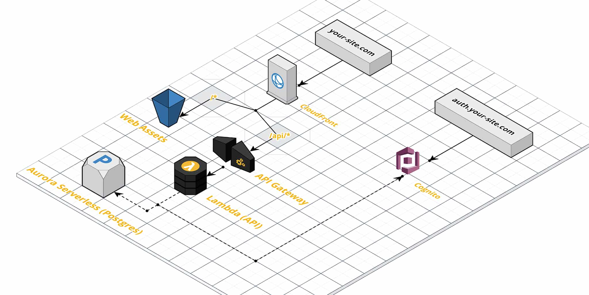

# Magic Serverless Project Template

This will create a serverless AWS stack that has:
 
- A frontend (Minimal, with Auth)
- A backend (Go, with Auth)
- Authentication (OAuth2)
- A relational database (Postgres)

### Automated Setup Script:

This will clone the latest template and insert your values.

_Note: You will need to create a GitHub repository and add your AWS credentials to the Secrets._

```bash
bash <(curl -s https://raw.githubusercontent.com/alshdavid/template-serverless-service/main/setup.bash)
```

## Architecture


 